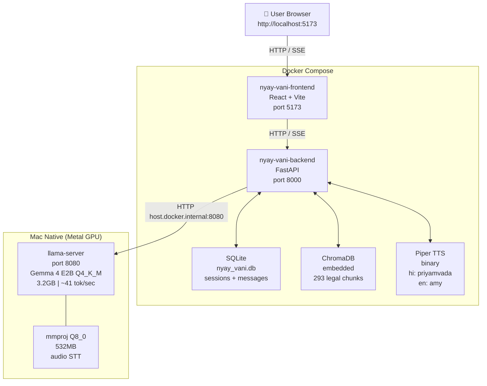
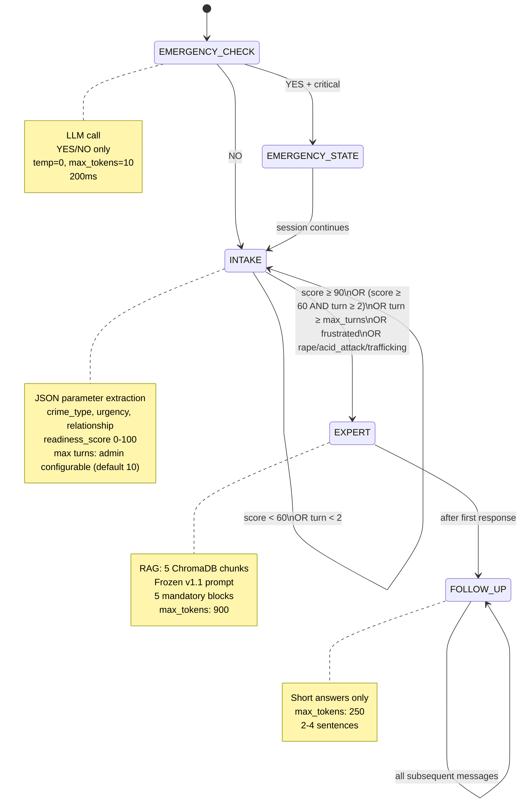
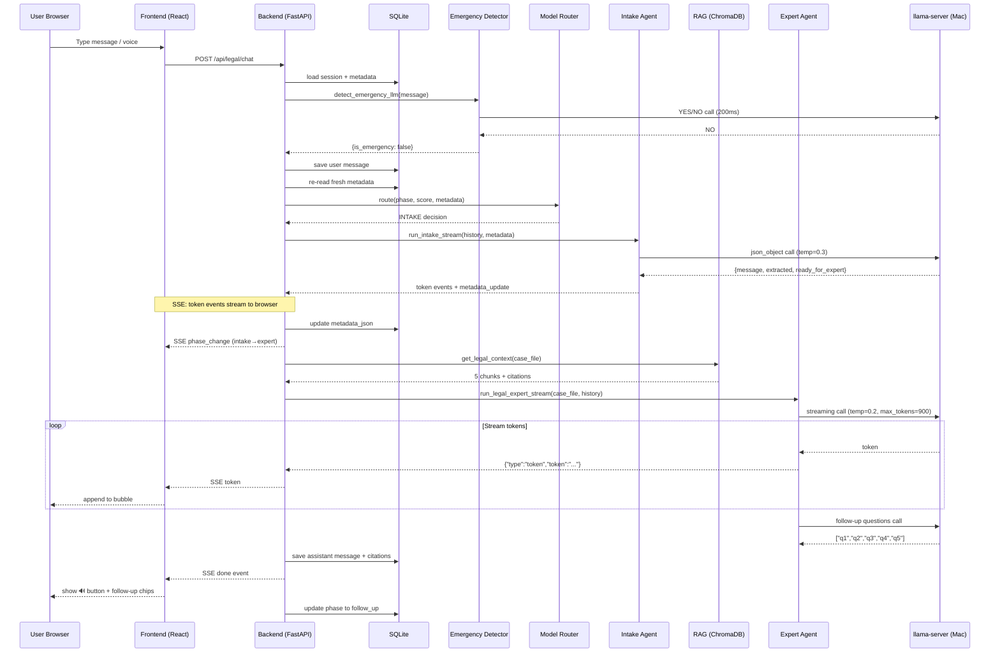
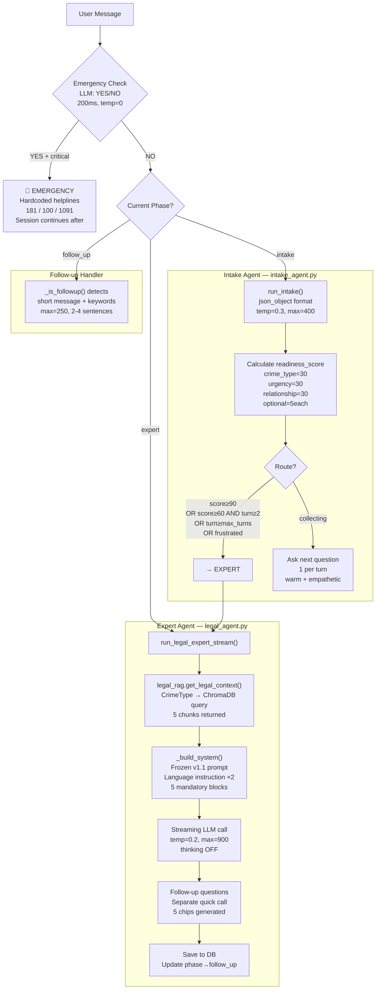
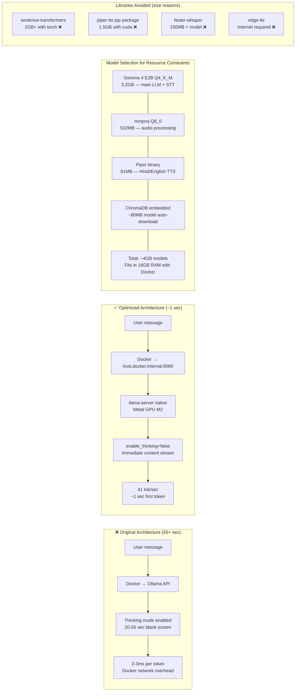
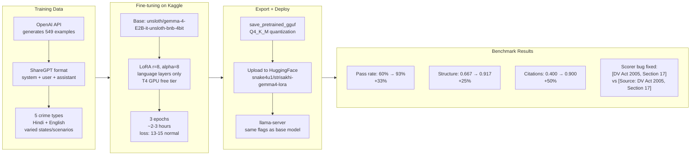
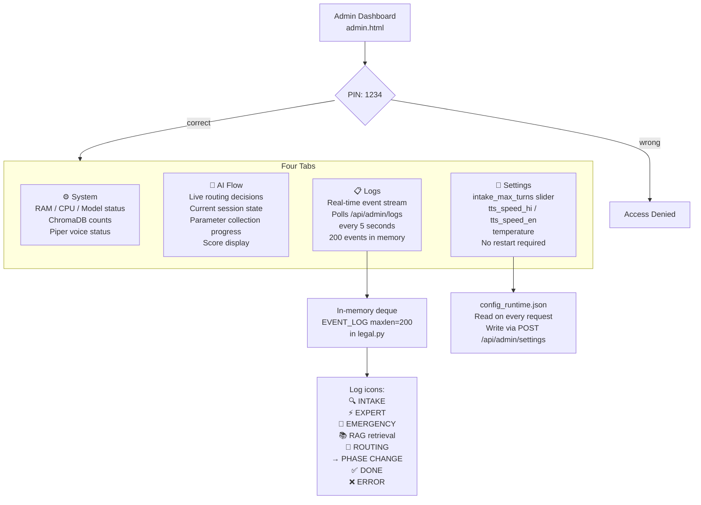
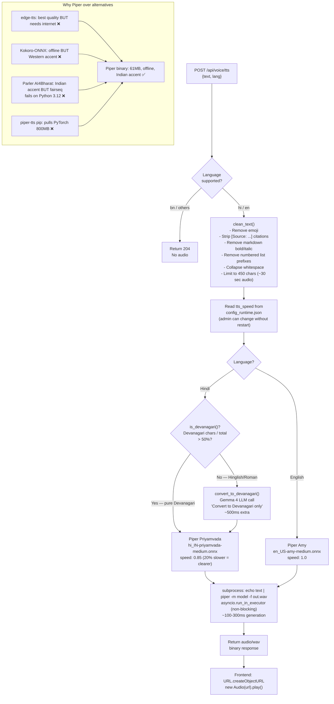

# StriSakhi — Architecture Diagrams
## Mermaid code for all diagrams

---

## 1. System Architecture

---

## 2. Kanoon Sakhi State Machine

---

## 3. Request Lifecycle — Full Pipeline

---

## 4. AI Flow — Kanoon Sakhi Agents

---

## 5. Performance Optimization Architecture

---

## 6. Fine-tuning Pipeline

---

## 7. Admin Dashboard Flow

---

## 8. Dynamic Prompt Engineering

```mermaid
flowchart TD
    REQ["Incoming request\n{session_id, message, language}"]

    REQ --> LANG["Language Config\nSingle source of truth\nhi / en / bn\nInstruction injected FIRST + LAST"]

    LANG --> PHASE{"Current Phase?"}

    PHASE -->|intake| IP
    PHASE -->|expert| EP
    PHASE -->|follow_up| FP

    subgraph IP["Intake Prompt — dynamic"]
        I1["Language instruction ×1"]
        I2["Persona: warm intake specialist"]
        I3["Parameters to collect\n(base: crime_type, urgency, relationship)\n+crime-specific Layer 3\n(injected based on detected crime_type)"]
        I4["Current case file\n(already collected — do NOT ask again)"]
        I5["Turn: X of MAX | Score: Y/100"]
        I6["Ready-for-expert conditions"]
        I7["JSON output schema\n(no markdown, no explanation)"]
        I8["Language instruction ×2"]
        I1 --> I2 --> I3 --> I4 --> I5 --> I6 --> I7 --> I8
    end

    subgraph EP["Expert Prompt — frozen v1.1"]
        E1["Language instruction ×1"]
        E2["Persona: 20yr senior advocate"]
        E3["Case file JSON\n(intake output)"]
        E4["Crime-specific guidance block\n(CRIME_GUIDANCE dict)"]
        E5["RAG context\n(5 ChromaDB chunks)"]
        E6["Conversation history\n(last 8 turns)"]
        E7["5 mandatory blocks\n(━━━ headers enforce structure)"]
        E8["Rules: 400 words max\nno lawyer without 15100"]
        E9["Language instruction ×2"]
        E1 --> E2 --> E3 --> E4 --> E5 --> E6 --> E7 --> E8 --> E9
    end

    subgraph FP["Follow-up Prompt — short"]
        F1["Language instruction ×1"]
        F2["Persona: answering follow-up only"]
        F3["Case file + conversation"]
        F4["Answer in 2-4 sentences\nmax_tokens: 250"]
        F5["Language instruction ×2"]
        F1 --> F2 --> F3 --> F4 --> F5
    end

    subgraph WHY["Why Language Instruction ×2?"]
        W1["Gemma 4 attends to beginning\nAND end of prompt most strongly"]
        W2["Middle gets diluted with long prompts"]
        W3["Repeating at end re-enforces\nDevanagari output rule"]
        W4["Result: 0.87-1.0 Hindi purity\nvs ~0.6 without repetition"]
        W1 --> W2 --> W3 --> W4
    end
```

---

## 9. TTS Pipeline

